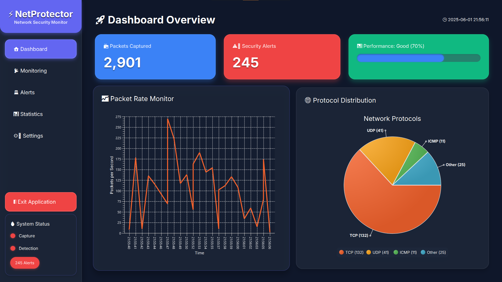
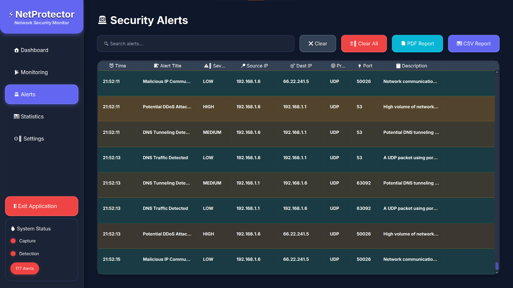

# NetProtector - Intrusion Detection System (IDS)


A comprehensive network security monitoring application built with Java and JavaFX that provides real-time intrusion detection and threat analysis capabilities.

## 🚀 Features

### Core Functionality
- **Real-time Network Monitoring**: Live packet capture and analysis using pcap4j
- **Multi-threaded Detection Engine**: 15+ security rules running concurrently
- **Interactive Dashboard**: JavaFX-based GUI with live statistics and monitoring
- **Alert Management**: Comprehensive notification system with desktop and email alerts
- **Historical Analysis**: SQLite database for persistent alert storage and analysis

### Security Detection Rules
- 🛡️ DDoS Attack Detection
- 🔐 Brute Force Attack Monitoring
- 💉 SQL Injection Detection
- 🕳️ DNS Tunneling Analysis
- 🚫 Malicious IP Monitoring
- 📡 Port Scanning Detection
- 🔍 Suspicious Traffic Analysis
- ⚠️ And many more...

### Reporting & Export
- 📊 PDF Report Generation
- 📈 CSV Data Export
- 📧 Email Notifications
- 🖥️ Desktop Alerts
- 📋 Detailed Logging

## 🛠️ Technology Stack

- **Language**: Java 17
- **UI Framework**: JavaFX 21
- **Build Tool**: Maven
- **Database**: SQLite
- **Packet Capture**: pcap4j
- **PDF Generation**: iTextPDF
- **Email**: Jakarta Mail
- **Data Export**: OpenCSV

## 📋 Prerequisites

- Java 17 or higher
- Maven 3.8+
- Windows/Linux/macOS
- Administrative privileges (for packet capture)
- Network interface access

## 🔧 Installation

1. **Clone the repository**
   ```bash
   git clone https://github.com/K4YR0/IDS_NetProtector.git
   cd IDS_NetProtector
   ```

2. **Install dependencies**
   ```bash
   mvn clean install
   ```

3. **Run the application**
   ```bash
   mvn javafx:run
   ```

   Or run the compiled JAR:
   ```bash
   java -jar target/IDS_NetProtector-1.0.jar
   ```

## 🚦 Quick Start

1. **Launch the application** with administrator privileges
2. **Select network interface** from the dropdown menu
3. **Configure detection rules** in the settings panel
4. **Start monitoring** by clicking the "Start IDS" button
5. **View real-time alerts** in the alerts panel
6. **Generate reports** using the export functionality

## 📁 Project Structure

```
IDS_NetProtector/
├── src/
│   ├── main/
│   │   ├── java/
│   │   │   └── com/NetProtector/
│   │   │       ├── controllers/     # JavaFX Controllers
│   │   │       ├── models/          # Data Models
│   │   │       ├── services/        # Business Logic
│   │   │       ├── utils/           # Utility Classes
│   │   │       └── Main.java        # Application Entry Point
│   │   └── resources/
│   │       ├── fxml/               # FXML Layout Files
│   │       ├── css/                # Stylesheets
│   │       └── images/             # Application Icons
├── target/                         # Compiled Output
├── pom.xml                        # Maven Configuration
└── README.md                      # Project Documentation
```

## ⚙️ Configuration

### Email Notifications
1. Copy `notification_placeholder.properties` to `notification.properties`
2. Configure your SMTP settings:
```properties
notification.email.username=your-email@gmail.com
notification.email.recipient=alerts@yourdomain.com
# For Gmail, use app passwords instead of your regular password
```

### Detection Rules
Customize detection thresholds and rules through the settings interface or configuration files.

## 📊 Screenshots


*Main Dashboard with Real-time Monitoring*


*Alert Management Interface*

## 🤝 Contributing

1. Fork the repository
2. Create a feature branch (`git checkout -b feature/amazing-feature`)
3. Commit your changes (`git commit -m 'Add amazing feature'`)
4. Push to the branch (`git push origin feature/amazing-feature`)
5. Open a Pull Request

## 📝 License

This project is licensed under the MIT License - see the [LICENSE](LICENSE) file for details.

## 🙏 Acknowledgments

- [pcap4j](https://github.com/kaitoy/pcap4j) for packet capture capabilities
- [JavaFX](https://openjfx.io/) for the modern UI framework
- [iTextPDF](https://itextpdf.com/) for PDF generation
- Open source community for various libraries and tools

## 🔮 Future Enhancements

- [ ] Machine Learning-based threat detection
- [ ] Web-based dashboard
- [ ] Integration with external threat intelligence feeds
- [ ] Advanced visualization and analytics
- [ ] Multi-node deployment support
- [ ] REST API for external integrations

---

⭐ If you found this project helpful, please give it a star on GitHub! ⭐